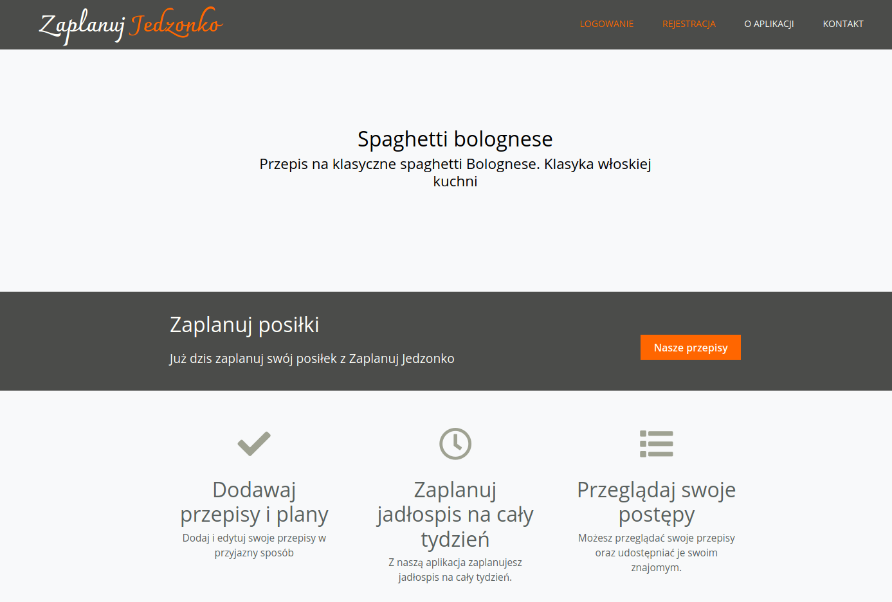
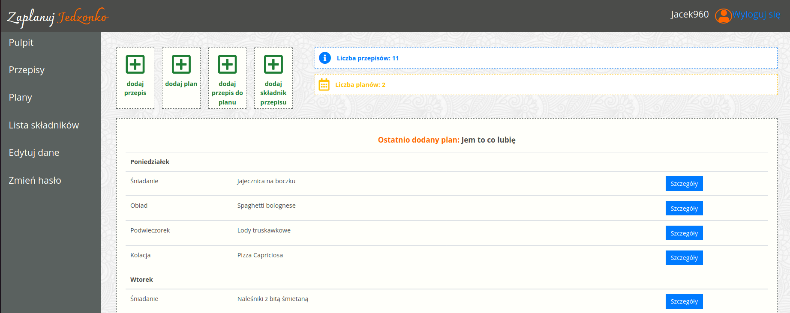
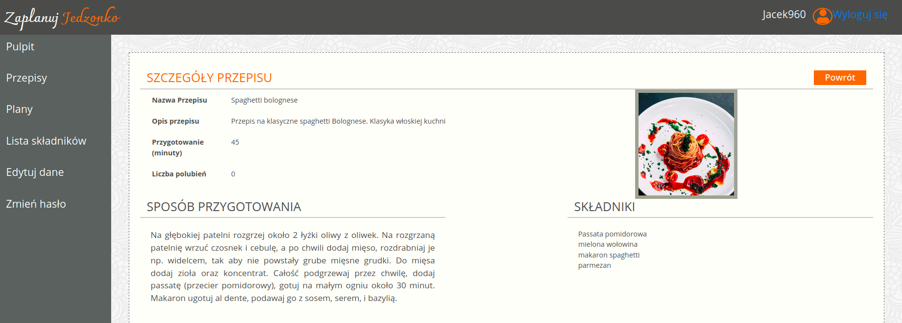

# Menu and recipe management system 
> Website - Menu and recipe management system

## Table of contents
* [General info](#general-info)
* [Screenshots](#screenshots)
* [Technologies](#technologies)
* [Setup](#setup)
* [Features](#features)
* [Status](#status)
* [Credits](#credits)
* [Contact](#contact)

## General info
Project rewritten. Previously done as a part of Scrumlab project with [Annliv81](https://github.com/Annliv81)  in Coders Lab 

## Screenshots
Home Page

Dashbord

Recipe page

## Technologies
* Django 2.2.15
* Python 3.8

## Setup
Use pip installation to install dependencies from requirements.txt
## Code requirements.txt

`$ pip install -r requirements.txt`

## Features
To-do list:
* Recipe Like button
* User-owner can select only his plans

## Status
Project is: _in_progress_

## Credits
Photos for project used from [Unsplash](https://unsplash.com/) Thank you all!

## Contact
Created by [Jacek960](mailto:j.kuciel@outlook.com)- feel free to contact me!

